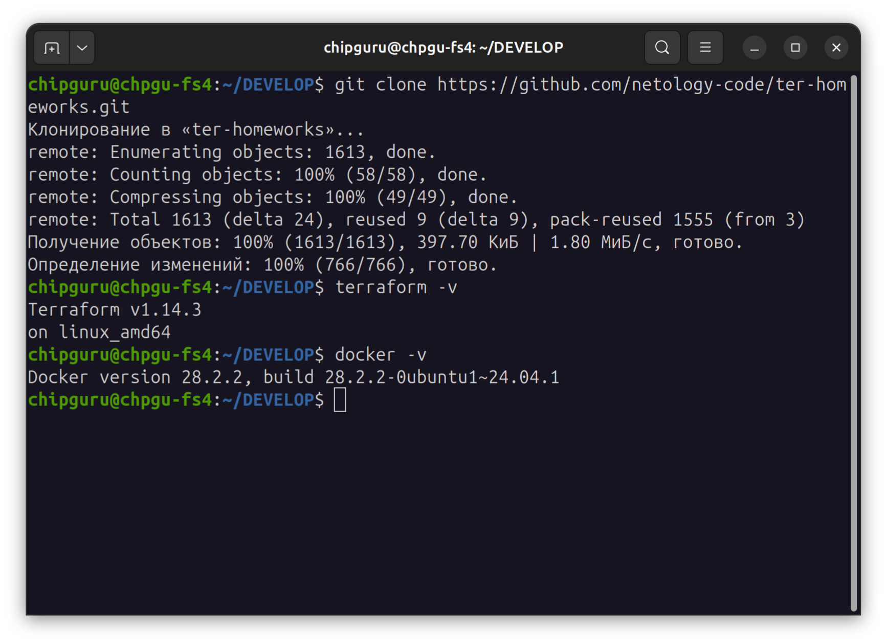
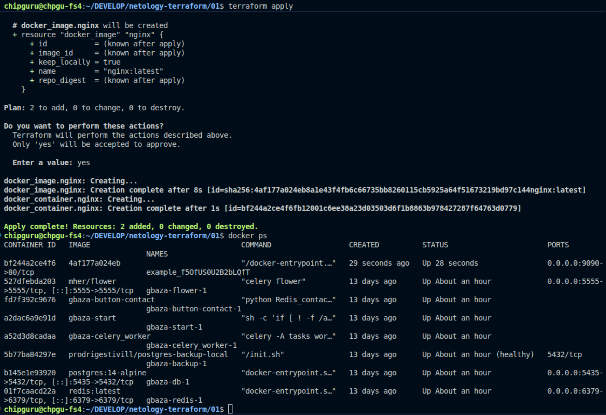
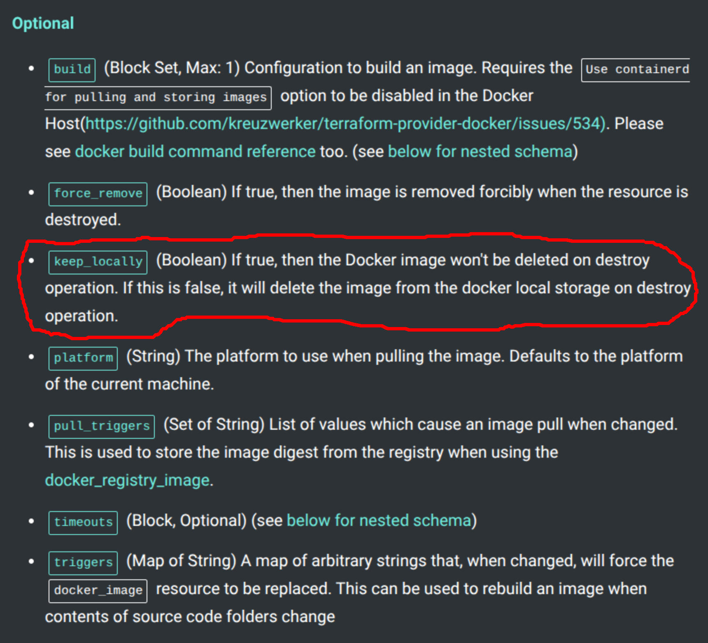

"result": "f5OfUS0U2B2bLQfT",

Пароль из random_password успешно подставился в имя контейнера, а сам Terraform корректно пересоздал ресурс после переименования логического имени в hello_world, после повторного запуска команды terraform apply -auto-approve, так как после первого запуска старый контейнер не был окончательно удален, и возникал конфликт - "имя уже занято"

На странице https://registry.terraform.io/providers/kreuzwerker/docker/latest/docs/resources/image#keep_locally

указано, что атрибут keep_locally по умолчанию имеет значение false. В таком случае при удалении ресурса docker_image образ будет удален из локального хранилища Docker. При значении true образ остается в локальном хранилище Docker даже после удаления ресурса docker_image.
