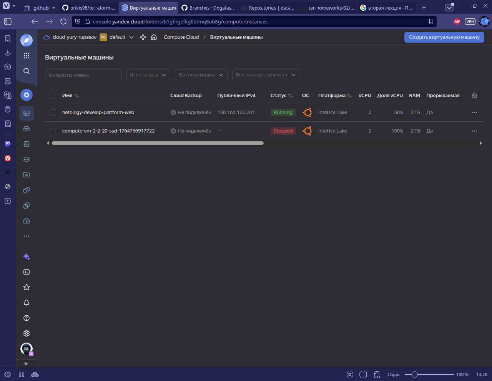
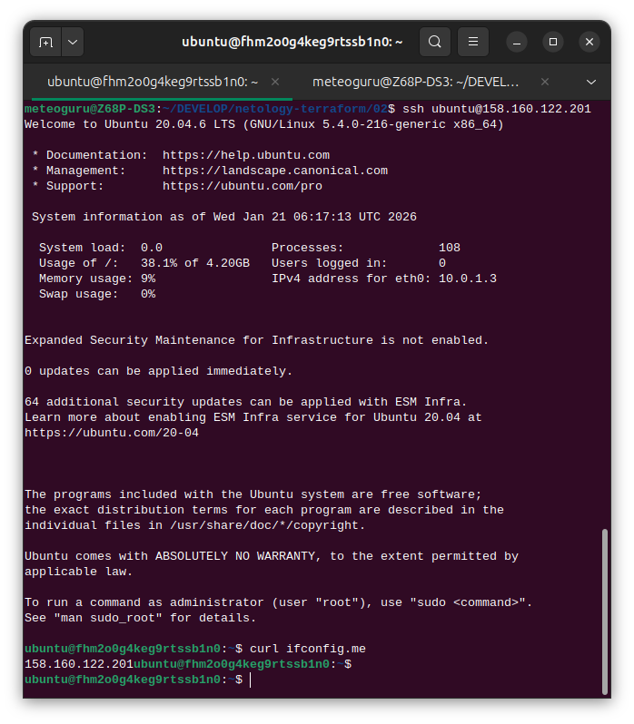

в процессе обучения могут пригодиться параметры preemptible = true и core_fraction = 5
preemptible = true  
Делает ВМ прерываемой и значительно дешёвой. Это удобно для учебных лабораторных работ, тестов и экспериментов, где не требуется гарантированная доступность.

core_fraction = 5 
Устанавливает минимальную гарантированную долю CPU (в %-ах).
Это позволяет запускать дешёвые учебные ВМ, экономя бюджет, когда высокая производительность не требуется.